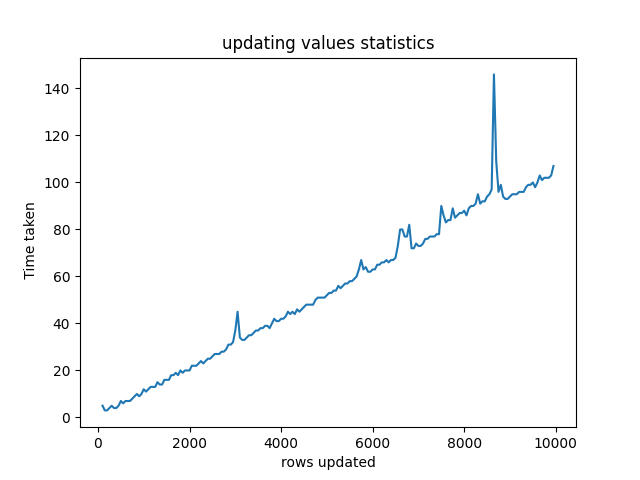

# low-level programming lab 1
## Сборка

Сборка происходит при помощи утилиты CMake. Для удобства добавлен скрипт build.sh. Стандарт языка должен быть минимум C11.

```bash
./build.sh
```

Для создания графиков по замеренным данным тестов, вам нужно иметь python и библиотеку matplotlib

## Цели задания

- Реализовать модуль хранения данных в файле в виде РСУБД
- Так как подразумевается хранение огромных массивов данных (больше чем размер ОЗУ), необходимо разработать архитектуру порционного доступа к данным без необходимости загружать данные целиком в память
- Организовать типизацию данных: поддерживать целые числа, строки, числа с плавающей точкой, булевы значения
- Реализовать интерфейсы для создания / удаления схемы, вставки, выборки (в т.ч по условию), удаления и обновления данных, учитывая отраженные в тексте задания ограничения по асимптотической сложности

- Обеспечить работоспособность решения на ОС Windows и Linux

## Задачи и ход работы

- Продумать и написать структуры и их содержимое (заголовки базы, заголовки для данных и др.)
- Определить набор интерфейсов для написанных структур
- Придумать реализацию принятых интерфейсов с учетом наложенных ограничений
- Протестировать функциональность написанных реализаций
- Протестировать соответствие написанных реализаций временным ограничениям
- Сделать профилирование на предмет обнаружения утечек памяти
- Протестировать работоспособность на ОС Windows и Linux

## Работа с памятью
### Структуры и методы структур, отвечающих за хранение данных

```c
#define PAGE_SIZE 8192
#define MIN_VALUABLE_SIZE 31

struct database_header {
    uint16_t page_size;
    uint16_t first_free_page;
    uint16_t next_page_to_save_number;
};

enum page_type {
    STRING_PAGE,
    TABLE_DATA
};

struct page_header {
    uint64_t page_number;
    uint64_t next_page_number;
    uint16_t data_offset;
    page_type type;
    table_header table_header;
};

struct page {
    page_header *pgheader;
    page *next_page;
    void *data;
    table *tb;
};

struct database {
    FILE *file;
    database_header *header;
    page *first_loaded_page;
    page **all_loaded_pages;
    size_t loaded_pages_capacity;
};
```

```c
maybe_database initdb(char *filename, bool overwrite);
void release_db(database *db);

maybe_page create_page(database *db, table *tb, page_type type);
void mark_page_saved_without_saving(page *pg);
maybe_page read_page_header(database *db, table *tb, uint16_t page_ordinal);
maybe_page get_page_header(database *db, table *tb, size_t page_number);
result read_page_data(database *db, page *pg_to_read);
maybe_page find_page(database *db, database_closure predicate);
page *rearrange_page_order(page *pg_to_save);
maybe_page get_page_by_number(database *db, table *tb, uint64_t page_ordinal);
maybe_page get_suitable_page(table *tb, size_t data_size, page_type type);
result ensure_enough_space_table(table *tb, size_t data_size, page_type type);
result write_page(page *pg);
void release_page(page *pg);
```
### Сохранение данных на диск
В заголовке базы данных хранится номер страницы, который следует за последней страницей в файле. Это нужно потому, что при создании временных таблиц (фильтр, джоин) страницам этих таблиц тоже присваивается порядковый номер. Скорее всего, эти таблицы не будут записаны на диск, поэтому у базы данных есть возможность менять номера страниц. База данных сохраняет страницу на файл только в том случае, если порядковый номер страницы равен следующему номеру после номера страницы, которая есть на диске. При этом сразу после смены номера страницы экземпляр базы данных вызывает метод из data.h, который корректирует все ссылки на строки в таблицах, и наоборот. В этот же момент происходит сборка мусора на переставляемых страницах.

## Таблицы

Таблицы представляют из себя обертку над страницами данных, абстракцию над реальной работой с памятью

### Структуры и методы структур, отвечающих за хранение данных

```c
#define MAX_NAME_LENGTH 31
#define MAX_COLUMN_AMOUNT 50

enum column_type {
    INT_32,
    FLOAT,
    STRING,
    BOOL
};

struct column_header {
    column_type type;
    char name[MAX_NAME_LENGTH];
};

struct table_header {
    uint8_t column_amount;
    uint16_t row_size;
    uint64_t first_data_page_num;
    uint64_t first_string_page_num;
    char name[MAX_NAME_LENGTH];
    column_header columns[MAX_COLUMN_AMOUNT];
};

struct table {
    page *first_page;
    page *first_string_page;
    page *first_page_to_write;
    page *first_string_page_to_write;
    table_header* header;
    database *db;
};
```
```c
uint8_t type_to_size(column_type type);
maybe_table read_table(const char *tablename, database *db);
maybe_table create_table(const char *tablename, database *db);
size_t offset_to_column(table_header *tb, const char *column_name, column_type type);
void release_table(table *tb);
result add_column(table *tb, const char *column_name, column_type type);
result save_table(database *db, table *tb);
void print_columns(table_header *tbheader);
result join_columns(table *dst, table *tb1, table *tb2, const char *column_name, column_type type);
void copy_columns(table *dst, table *src);
```
### Страницы данных

Пространство памяти делится на страницы, размером 8КБ. 
На одной странице хранятся данные одной таблицы, поэтому в заголовке страницы можно хранить заголовок таблицы, в котором указаны метаданные таблицы: количество строк данных, данные о столбцах (название, тип). Данные типа INT32, BOOL, FLOAT хранятся напрямую в странице данных. Фиксированный размер строки данных позволяет при удалении одной строки на ее место записать строку данных, которая была записана последней.
Строки заслуживают отдельного рассмотрения, ниже им будет посвящен раздел

### Страницы строк

MIN_VALUABLE_SIZE показывает, насколько маленьким может быть оставшееся на странице пространство чтобы при поиске страницы подходящего размера для новой строки не учитывать страницу. 
Страницы образуют связный список, поэтому, даже если после страницы со свободным местом > MIN_VALUABLE_SIZE идут заполненные страницы, поиск страницы подходящего размера будет начинаться с этой страницы, таким образом проходя и те страницы, которые заведомо имеют свободное место, меньше чем MIN_VALUABLE_SIZE. Такой подход позволяет эффективно использовать память при работе со строками, при этом немного жертвуя производительностью.

## Данные таблицы

В таблицах нам удобно работать с ее рядами на уровне некоторой абстракции. Роль этой абстракции выполняет структура ```data```. Она позволяет унифицированно работать как с рядами, уже находящимися в таблице, так и с данными, которым только предстоит в нее попасть.

### Структуры и методы структур, отвечающих за абстракцию рядов таблицы

```c
typedef struct {
    table *table;
    char *bytes;
    uint16_t size;
} data;
```

```c
maybe_data init_data(table *tb);
maybe_data init_empty_data(table *tb);
void release_data(data *dt);
void clear_data(data *dt);
result data_init_integer(data *dt, int32_t val);
result data_init_string(data *dt, const char* val);
result data_init_boolean(data *dt, bool val);
result data_init_float(data *dt, float val);
result data_init_any(data *dt, const any_value val, column_type type);
result set_data(data *dt);
result delete_saved_row(data *dt, page *pg);
void get_integer_from_data(data *dt, int32_t *dest, size_t offset);
void get_string_from_data(data *dt, char **dest, size_t data_offset);
void get_bool_from_data(data *dt, bool *dest, size_t offset);
void get_float_from_data(data *dt, float *dest, size_t offset);
void get_any_from_data(data *dt, any_value *dest, size_t offset, column_type type);
void update_string_data_for_row(data *dst, page *dst_pg, data *src);
bool has_next_data_on_page(page *cur_page, char *cur_data);
void prepare_data_for_saving(page *pg);
void print_data(data *dt);
result copy_data(data *dst, data *src);
result join_data(data *dst, data *dt1, data *dt2, const char *column_name, column_type type);
```

## Итератор по данным таблицы

Имея структуру ```data```, мы с легкостью можем составить новую структуру для последовательного обхода всех этементов таблицы - ```data_iterator```. При работе с итератором мне показалось, что было бы удобно так же сделать структуру, которая бы имитировала замыкания для того, чтобы настройка предиката при поиске элемента была проще и понятнее. Такой структурой стал ```closure```:
```c
typedef struct {
    bool (*func)(any_value *value1, any_value *value2);
    any_value value1;
} closure;
```

### Структуры и методы структур, отвечающих за итератор по данным таблицы

```c
typedef struct {
    table* tb;
    page* cur_page;
    uint16_t ptr;
    uint16_t rows_read_on_page;
    data* cur_data;
} data_iterator;

typedef struct {
    result error;
    int16_t count;
} result_with_count;
```

```c
maybe_data_iterator init_iterator(table* tb);
void reset_iterator(data_iterator *iter, table *tb);
void release_iterator(data_iterator *iter);
void get_next(data_iterator *iter);
bool seek_next_where(data_iterator* iter, column_type type, const char *column_name, closure predicate_closure);
result_with_count delete_where(table*tb, column_type type, const char *column_name, closure predicate_closure);
result_with_count update_where(table* tb, column_type type, const char *column_name, closure predicate_closure, data *updateVal);
maybe_table join_table(table* tb1, table* tb2, const char* column_name, column_type type, char *new_table_name);
maybe_table filter_table(table*tb, column_type type, const char *column_name, closure predicate_closure);
void print_table(table *tb);
```

## Строки

Особенное внимание хочу обратить на работу со строками: так как они могут быть любого размера, в таблицу заносится лишь ссылка на строку ( ```string_data_ref``` ).
```c
typedef struct {
    uint64_t string_page_number;
    uint64_t offset;
} string_data_ref;

typedef struct {
    string_data_ref     link_to_current; // ссылка на ссылку, которая указывает на текущую строку
    uint64_t            str_len;
    string_data_ref     next_part; // ссылка на следующую часть строки
    bool                enabled;
    char                string[];
} string_in_storage;
```
Строки образуют двусвязный список. Это нужно для того, чтобы при перемещении страницы можно было бы изменить ссылку на перемещающуюся строку.
При удалении или изменении строки (при изменении происходит удаление изменяемой строки и запись новой на страницу подходящего размера) старая строка помечается удаленной. При сохранении страницы с удаленными строками все последующие на странице строки сдвигаются на длину строки, их ссылки обновляются.

## Аспекты реализации

Для начала работы необходимо создать базу данных. Внутри режим открытия файла определяется автоматически: если базу данных нужно переписать (второй аргумент функции initdb), то при открыти будет выбран режим, удаляющий сожержимое файла. Во время создания базы данных может возникнуть ошибка, поэтому после вызова ```initdb``` нужно проверить, что флаг ошибки не выставлен:

```c
maybe_database db = initdb(filename, true);
if (db.error) {
    print_if_failure(db.error);
    return 1;
}
```

После создания базы данных можно создавать таблицу. Она так же возвращает optional, так что после вызова нужно проверить ее на наличие флага error:
```c
maybe_table tb = create_table("test table", db);
```

Пока в таблицу не записаны данные, можно добавлять информацию о столбцах таблицы (после добавления данных функция add_column будет возвращать ошибку):
```c
result add_error = add_column(tb.value, "example ints column", INT_32);
if (add_error) return add_error;
add_error = add_column(tb.value, "example strings column", STRING);
```
Заполнение таблицы данными происходит при помощи структуры ```data```
После инициализации структуры данными требуется вызвать функцию ```set_data``` для вставки данных
```c
result fill_table_with_data(database *db, table *tb, size_t columns_count, size_t rows_count, any_typed_value values[rows_count][columns_count]) {
    result filling_error = OK;
    maybe_data dt = init_data(tb);
    if (dt.error) {
        filling_error = dt.error;
        goto release_dt;
    }
    for (size_t rows = 0; rows < rows_count; rows++) {
        for (size_t columns = 0; columns < columns_count; columns ++) {
            filling_error = data_init_any(dt.value, values[rows][columns].value, values[rows][columns].type);
            if (filling_error) goto release_dt;
        }
        filling_error = set_data(dt.value);
        if (filling_error) goto release_dt;
        clear_data(dt.value);
    }

release_dt:
    release_data(dt.value);
    return filling_error;
}
```
Функция ```ensure_enough_space_table``` удостоверяется, что страница ```table->first_page_to_write``` подходящего размера для данного размера данных. Если нужно, она же создает новую страницу.
```c
result set_data(data *dt) {
    result is_enough_space = ensure_enough_space_table(dt->table, dt->size, TABLE_DATA);
    if (is_enough_space) return is_enough_space;

    char *data_ptr = dt->bytes;

    page *pg_to_write = dt->table->first_page_to_write;
    uint64_t offset_to_row = pg_to_write->pgheader->data_offset;

    set_page_info_in_strings(dt, pg_to_write->pgheader->page_number, offset_to_row);

    void **table_ptr = pg_to_write->data + offset_to_row;
    memcpy(table_ptr, data_ptr, dt->size);

    dt->table->first_page_to_write->pgheader->data_offset += dt->size;

    return OK;
}
```
При добавлении целочисленных, булевых и чисел с плавающей точкой типов, данные записываются в память ```data```, в то время как для строк уже в этот момент выделяются страницы. Если нужно, строка делится на несколько страниц, и в заголовок строки ставится указатель на следующую часть строки. Указатель на первую строку для записи хранится в структуре ```table```.
Данные в ```data``` хранятся последовательно друг за другом
```c
result data_init_integer(data *dt, int32_t val) {
    if (dt->size + type_to_size(INT_32) > dt->table->header->row_size) return NOT_ENOUGH_SPACE;
    char *ptr = (char *)dt->bytes + dt->size;
    *( (int32_t*) ptr ) = val;
    dt->size += type_to_size(INT_32);
    return OK;
}

result data_init_string(data *dt, const char* val) {
    if (dt->size + type_to_size(STRING) > dt->table->header->row_size) return NOT_ENOUGH_SPACE;
    char *ptr = dt->bytes + dt->size;
    dt->size += type_to_size(STRING);

    size_t string_len = strlen(val) + 1;
    string_data_ref *cur_string_ref = (string_data_ref *)ptr;
    string_data_ref *prev_string_ref = NULL;
    string_data_ref written_string_ref = (string_data_ref){};
    size_t string_offset = 0;

    while (string_len > 0) {
        size_t cur_string_len = MIN(string_len, PAGE_SIZE - sizeof(string_in_storage));

        string_data_ref previously_written_ref = written_string_ref;
        string_data_ref *future_string_ref = data_init_one_page_string(dt, val + string_offset, cur_string_ref, &prev_string_ref, cur_string_len);
        written_string_ref = *cur_string_ref;
        cur_string_ref = future_string_ref;
        if (prev_string_ref != NULL && previously_written_ref.string_page_number != 0) {
            previously_written_ref.offset += sizeof(string_data_ref) + sizeof(uint64_t);
            *prev_string_ref = previously_written_ref;
        }

        string_offset += cur_string_len;
        string_len -= cur_string_len;
    }
    
    return OK;
}

result data_init_boolean(data *dt, bool val) {
    if (dt->size + type_to_size(BOOL) > dt->table->header->row_size) return NOT_ENOUGH_SPACE;
    char *ptr = (char *)dt->bytes + dt->size;
    *( (bool*) ptr ) = val;
    dt->size += type_to_size(BOOL);
    return OK;
}

result data_init_float(data *dt, float val) {
    if (dt->size + type_to_size(FLOAT) > dt->table->header->row_size) return NOT_ENOUGH_SPACE;
    char *ptr = (char *)dt->bytes + dt->size;
    *( (float*) ptr ) = val;
    dt->size += type_to_size(FLOAT);
    return OK;
}

result data_init_any(data *dt, const any_value val, column_type type) {
    switch (type) {
    case INT_32:
        return data_init_integer(dt, val.int_value);
    case FLOAT:
        return data_init_float(dt, val.float_value);
    case BOOL:
        return data_init_boolean(dt, val.bool_value);
    case STRING:
        return data_init_string(dt, val.string_value);
    default:
        break;
    }
}

```
Доступ к уже существующим в файле данным происходит при помощи ```data_iterator``` и интерфейсов для работы с ним
```c
bool seek_next_where(data_iterator *iter, column_type type, const char *column_name, closure clr) {
    if (!has_next(iter)) return false;

    size_t offset = offset_to_column(iter->tb->header, column_name, type);
    
    while (has_next(iter)) {
        while (iter->cur_data->bytes - (char *)iter->cur_page->data >= iter->cur_page->pgheader->data_offset) {
            if (iter->cur_page->pgheader->next_page_number == 0) return false;
            
            maybe_page next_page = get_page_by_number(iter->tb->db, iter->tb, iter->cur_page->pgheader->next_page_number);
            iter->cur_page->next_page = next_page.value;
            iter->cur_page = next_page.value;
            iter->cur_data->bytes = iter->cur_page->data;
        }

        any_value value;
        get_any(iter, &value, offset, type);

        if ( clr.func(&clr.value1, &value) ) {
            if (type == STRING) free(value.string_value);
            return true;
        }

        get_next(iter);
    }
    return false;
}
```

```c
result_with_count update_where(table* tb, column_type type, const char *column_name, closure clr, data *update_val) {
    maybe_data_iterator iterator = init_iterator(tb);
    if (iterator.error) return (result_with_count) { .error=iterator.error, .count=0 };
    int16_t update_count = 0;
    while (seek_next_where(iterator.value, type, column_name, clr)) {
        data *data_to_update = iterator.value->cur_data;
        update_string_data_for_row(data_to_update, iterator.value->cur_page, update_val);
        update_count++;
    }

    release_iterator(iterator.value);
    return (result_with_count) { .error=OK, .count=update_count };
}
```

```c
result_with_count delete_where(table *tb, column_type type, const char *column_name, closure clr) {
    maybe_data_iterator iterator = init_iterator(tb);
    if (iterator.error) return (result_with_count) { .error=iterator.error, .count=0 };
    int16_t delete_count = 0;
    while (seek_next_where(iterator.value, type, column_name, clr)) {
        data *data_to_delete = iterator.value->cur_data;
        result delete_error = delete_saved_row(data_to_delete, iterator.value->cur_page);
        if (delete_error) {
            release_iterator(iterator.value);
            return (result_with_count) { .error=delete_error, .count=0 };
        }
        delete_count++;
    }

    release_iterator(iterator.value);
    return (result_with_count) { .error=OK, .count=delete_count };
}
```
В данных функциях для нахождения значения используется ```closure``` - моя реализация замыканий
```c
typedef struct {
    union{
        int32_t int_value;
        float float_value;
        bool bool_value;
        char *string_value;
    };
} any_value;

typedef struct {
    bool (*func)(any_value *value1, any_value *value2);
    any_value value1;
} closure;
```

Функция ```seek_next_where```, лежащая в основе всех остальных интерфейсов ```data_iterator``` работает следующим образом:

- На вход функции подается итератор для конкретной таблицы
- Функция считывает данные по указателю данных и передает считанное значение в функцию-предикат. Если она возвращает ```true```, то функция возвращает ```true```
- После этого можно прочитать конкретное значение указываемой итератором строки при помощи функций ```get*Type*()```, передав туда имя желаемого столбца
- Если страница с данными закончилась, то функция освобождает её, загружая следующую и пытается читать данные оттуда
- Если данных не осталось, функция возвращает ```false```


## Результаты

Результат записи 1000 строк в таблицу. По оси абсцисс - номер записанной строки, по оси ординат - время записи в микросекундах.


Результат чтения 1000 строк из таблицы. По оси абсцисс - номер считанной строки, по оси ординат - время, потраченное на поиск строки в микросекундах.


Результат удаления строк таблицы. По оси абсцисс - количество удаленных строк, по оси ординат - время, потраченное на удаление строк в микросекундах. После каждого удаления таблица дополнялась до изначального количества элементов.


Результат обновления строк таблицы. По оси абсцисс - количество измененных строк, по оси ординат - время, потраченное на поиск и изменение строк в микросекундах.



Замеры размеров файла базы данных после добавления строки и сохранения таблицы. По оси абсцисс - количество добавленных строк, по оси ординат - размер файла базы данных в байтах.


